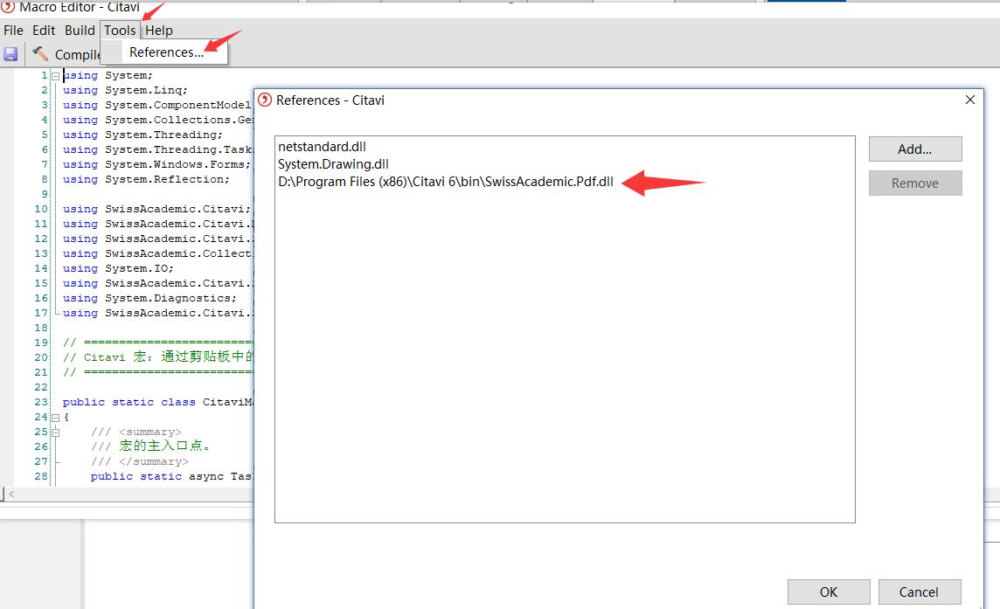

# myCitaviMacros
This is the repo of my custom Macros of citavi 6.8

2025-11-08更新，更完善，需要的同学用GPT让ai总结一下就好了，非常简单。
请注意：有些宏需要引用dll。
配合MacroManagerWithAutoRef插件用会更好[myCitaviAddonCode](https://github.com/AlexShyXie/myCitaviAddonCode)
> MacroManager插件加入AutoRef插件的功能，在MacroManager的edit和run运行的时候能够自动加载引用。
> 原版AutoRef只有先打开macros editor，然后open一个新的宏文件，才会自动加载引用，相对鸡肋。

## 2025-11-21更新0CitaviOb、AutoHotKeyURL配合0CitaviOb、Quicker动作预设
所需的脚本，均在这里，有兴趣的可以自己配置。如果需要调试，可以请我喝杯果汁饮料😂😂😂。
以下是联动的详细说明：
### **一、 核心设计理念：协议化、自动化、无感化**
整个方案的基石，是利用 **自定义 URL 协议** 将 Citavi 的每一个核心对象（文献条目、知识条目、PDF注释）变成一个可被外部程序精准调用的“网络资源”。
-   **Citavi → Obsidian**：通过 Citavi 宏，一键生成包含核心信息与跳转链接的 Markdown 字符串，复制到剪贴板。
-   **Obsidian → Citavi**：在 Obsidian 中点击链接，通过 AutoHotkey 脚本解析协议，自动激活 Citavi 并定位到对应条目，再通过模拟按键完成最终操作。

整个过程，用户只需要“一键生成”和“一键点击”，中间所有的切换、定位、输入均由脚本在后台自动完成。
### **二、 方案架构与四大组件**
这套工作流由四个核心组件构成，各司其职，协同工作：

1.  **Citavi 宏（C#）**：信息生成器。
2.  **AutoHotkey 脚本（AHK v2）**：协议解析与任务调度中心。
3.  **Windows 注册表（.reg 文件）**：协议的“户口本”。
4.  **Quicker 动作（.json 文件）**：人机交互的“遥控器”。

下面我们详细拆解每个组件的角色。
### **三、 组件详解与实现原理**
#### **1. Citavi 宏：在源头生成“智能链接”**
我编写了三个 Citavi 宏，分别对应三种最常用的场景：
-   **`4获取选中的reference制作ahk外链.cs`**：针对文献条目。
-   **`5获取选中的knowledge制作ahk外链.cs`**：针对知识条目。
-   **`6获取选中的annotation制作ahk外链.cs`**：针对 PDF 中的高亮或注释。

**核心功能**：
这些宏的核心任务是提取当前选中对象的元数据，并格式化为一个包含两部分内容的字符串：
`(引用文本) [ahklink](ahk://citavi/goto?type=xxx&id=xxx&project=xxx&projectType=xxx)`
**技术亮点**：
-   **智能信息提取**：自动抓取作者、年份、标题、分组、核心陈述等信息，并格式化（如多作者自动变为“第一作者 et al.”）。
-   **项目信息兼容**：通过 `GetProjectInfo` 函数，能智能识别项目是本地 `DesktopSQLite` 类型（获取文件路径）还是服务器 `DesktopSqlServer` 类型（获取项目名），并生成对应的 `project` 和 `projectType` 参数。
-   **URL 编码**：对路径中的空格等特殊字符进行 `%20` 编码，确保链接的健壮性。

**使用方式**：在 Citavi 中选中目标，通过快捷键或菜单运行宏，格式化好的链接就已复制到剪贴板。
#### **2. AutoHotkey 脚本：后台的“交通指挥官”**
这是整个方案的中枢神经，即 `ahkURLforCitavi.ahk`。它负责响应 `ahk://` 协议的调用。
**核心工作流程**：
1.  **接收与解析**：脚本启动后，通过 `A_Args[1]` 获取传入的完整 URL。使用 `RegExMatch` 精准提取 `type`、`id`、`project` 和 `projectType` 四个关键参数。
2.  **URL 解码**：调用 `ChineseUrlDecode` 函数，对 `project` 参数进行解码，还原出真实的路径或项目名。
3.  **智能窗口定位与激活**：
    -   **分支判断**：根据 `projectType` 的值执行不同逻辑。    
    -   **本地项目 (`DesktopSQLite`)**：    
        -   首先，它会循环尝试匹配 `项目名: Reference Editor`、`项目名: Knowledge Organizer`、`项目名: Task Planner` 三种可能的窗口标题，确保无论用户上次停留在哪个工作区都能找到。        
        -   如果找不到窗口，它会判断 Citavi 是否在运行。如果没运行，则直接 `Run(项目路径)` 打开；如果已在运行但项目未打开，则同样 `Run(项目路径)` 加载项目。        
        -   打开后，会再次循环等待并激活目标窗口。        
    -   **服务器/云端项目**：    
        -   由于无法通过文件路径直接打开，脚本仅通过项目名匹配窗口标题。        
        -   如果找不到，会直接弹出提示，告知用户“请手动在Citavi中打开此项目后再试”，逻辑清晰，不做无效操作。        
4.  **执行最终操作**：窗口成功激活后，脚本将提取的 `id` 写入剪贴板，切换到英文输入法，然后根据 `type` 的值发送不同的快捷键组合（如 `!M02R` 对应 `Ref`），触发 Citavi 内部的“通过ID定位并选中”功能。

## **Citavi 宏功能分类说明**
### **`0CitaviOb`：Citavi 与 Obsidian 深度联动**
这是整个宏集合的精华部分，专注于打通 Citavi 和 Obsidian 之间的数据壁垒，构建双向知识流。
*   **数据获取与预览系列**：
    *   `0从剪切版获取AnnotID并在预览中显示.cs`
    *   `1从剪切版获取Knowledge并在预览中显示.cs`
    *   `2从剪切版获取Reference并在预览中显示.cs`
    *   `3从剪切版获取PDF路径并在预览中显示.cs`
    *   **功能**：通过复制 ID 到剪贴板，快速在预览窗口中获取对应的标注、知识条目、文献信息或 PDF 路径，是联动的基础。
*   **信息提取与转换系列**：
    *   `4获取选中的reference文献信息.cs`
    *   `导出文献信息为YAML格式.cs`
    *   **功能**：直接提取当前选中文献的详细信息，并可导出为 YAML 格式，方便在 Obsidian 等工具中作为元数据使用。
*   **坐标转换核心系列**：
    *   `5从knowledge获取annotation并将quad转换成pdf++rect坐标.cs`
    *   `6从annotation获取quad和knowledge信息并转换成pdf++rect坐标.cs`
    *   **功能**：解决不同软件间 PDF 标注坐标不兼容的关键技术。将 Citavi 的 `quad` 坐标转换为 PDF++ 等工具能识别的 `rect` 坐标，实现高亮区域的精准同步。
*   **辅助与调试**：
    *   `7单纯选中knowledge获取CoreState和ID.cs`：用于调试，获取知识条目的核心状态和 ID。
    *   `参考：高亮Knowledge条目.cs`：一个参考实现，用于高亮显示知识条目。
    *   `失败CopyTextOfSelectedAnnotation.cs`：一个失败的尝试记录，可能用于调试或作为反面教材。
    *   `获取选中的annotation-knowledge信息-...版.cs`：多个版本的同功能宏，可能针对不同的预览场景（全屏、右侧面板等）进行了优化。

> 使用展示：[CitaviOb联动展示，借用quicker和宏完美联动](https://www.bilibili.com/video/BV1tKypBXEc4/?vd_source=857596c2407193aa21fbf8196a4abfec)

### **`1影响因子及翻译`：文献信息增强**
利用外部服务和 AI，批量丰富和翻译文献元数据。
*   **`easyScholarIF影响因子.cs`**：调用 easyScholar 等服务，批量获取文献的影响因子。
*   **AI 翻译系列**：
    *   `2ollamaWin10_AbstractAndTitleOfSelected.cs`
    *   `3智谱4flash_AbstractAndTitleOfSelected.cs`
    *   `ChatGLM3_AbstractAndTitleOfSelected.cs`
    *   `ChatGLM3_TitleOfSelected.cs`
    *   **功能**：集成不同的 AI 模型（本地 Ollama、智谱 AI、ChatGLM），批量翻译选中文献的摘要和标题。
*   **字段转换系列**：
    *   `0ConvertNoteToTableContentAndExtraField.cs`
    *   `0ConvertTranslateTitle2Custom6.cs`
    *   `1TransT转换为Custom6.cs`
    *   **功能**：将笔记或翻译后的标题内容转换并存入 Citavi 的自定义字段（如 Custom6）或表格中，便于管理和引用。

### **`2分组转换`：文献组织体系重构**
用于在 Citavi 的不同组织方式（分组、关键词、分类）之间进行批量转换。
*   **`ConvertCategoriesToGroups_v1.0.cs`**：将分类转换为分组。
*   **`ConvertGroupsToCategories_v1.0.cs`**：将分组转换为分类。
*   **`ConvertGroupsToKeyword_v1.0.cs`**：将分组转换为关键词。
*   **`ConvertKeywordsToCategories_v1.0.cs`**：将关键词转换为分类。
*   **`ConvertTTitle2CitationKeyAndShortTitle.cs`**：根据标题生成引用键和短标题。
*   **`清理分组名称中的特殊字符.cs`**：批量清理分组名中的非法或多余字符，保持整洁。

### **`3Reference管理`：文献条目标准化**
专注于文献条目本身的信息管理和格式化。
*   **引用键格式化**：
    *   `1_重置引用键为系统默认.cs`
    *   `2_重置引用键为简短格式.cs`
    *   `3_重置引用键为自定义格式.cs`
    *   **功能**：提供三种方式批量重置项目中的引用键格式。
*   **信息自动补全与修正**：
    *   `提取DOI链接到DOI字段.cs`：从其他字段中提取 DOI 并填入标准 DOI 字段。
    *   `根据DOI或PMID更新文献信息.cs`：通过 DOI 或 PMID 在线查询并补全文献信息。
    *   `根据ISSN自动补全期刊信息.cs`：通过 ISSN 自动补全期刊的详细信息。
    *   `根据分割符调换修改title.cs`：根据特定分隔符对标题进行批量修改和调整。

### **`4Knowledge管理`：知识卡片高效整理**
对 Citavi 的核心功能——知识模块进行批量操作和高级管理。
*   **`1_导出知识组为Markdown文档.cs`**：将一个知识组下的所有条目导出为结构化的 Markdown 文档。
*   **`1_按文献重排知识并生成子标题.cs`**：将知识条目按其来源文献重新组织，并自动生成文献标题作为子标题。
*   **`2_按文献标题创建分类并同步.cs`**：根据文献标题自动创建分类，并将对应的知识条目归入其中。
*   **`3_合并多个知识分类到指定的一个分类中.cs`**：将多个分类的知识条目合并到一个目标分类下。
*   **`4_检测隐藏且没有entity的knowledge并删除.cs`**：清理无效的“僵尸”知识条目。
*   **`5_检测隐藏的Annotation并删除.cs`**：清理无效的隐藏标注。
*   **`Knowledge界面预览PDF高亮.cs`**：在知识管理界面直接预览 PDF 上的高亮区域。
*   **`从剪切版获取条目 Open KnowledgeItem with ID from Clipboard.cs`**：通过剪贴板中的 ID 快速打开对应的知识条目。

### **`5附件信息修整`：附件管理与修复**
解决 PDF 等附件的路径问题，确保链接正常。
*   **`1重新定位附件路径.cs`**：当附件移动后，批量更新其路径链接。
*   **`2查找未关联条目的知识项.cs`**：找出那些没有关联到任何文献条目的“孤儿”知识项。
*   **`批量移动附件到Citavi文件夹.cs`**：将散落在各处的附件统一移动到 Citavi 项目的标准附件文件夹中。
*   **`拆分和修正附件路径.cs`**：对不规范的附件路径进行批量修正。
*   **`附件文件夹文件链接状态检查器.cs`**：扫描所有附件，检查链接是否有效，并生成报告。

### **`6PDF导入`：批量导入与自动分组**
高效地将本地 PDF 文件导入 Citavi，并自动进行组织。
*   **`1按文件夹分层并Group.cs`**：导入时，根据源文件夹的层级结构自动创建分组。
*   **`2按文件夹分层并Category.cs`**：导入时，根据源文件夹的层级结构自动创建分类。
*   **`3分文件夹批量导入课件PDF.cs`**：专门用于批量导入存放在不同文件夹中的课件类 PDF。
*   **`4导入单一文件夹内的PDF.cs`**：导入指定单个文件夹内的所有 PDF 文件。

### **`Macros自己的参考` & `z已做成插件`：开发资源与成品**
*   **`Macros自己的参考`**：存放一些宏开发过程中的参考代码、旧版本或被弃用的功能，是学习和二次开发的宝贵资源。
*   **`z已做成插件`**：这部分是宏的“最终形态”。一些功能稳定、使用频繁的宏已经被进一步封装成了独立的 Citavi 插件（`.dll` 文件），提供更稳定、更集成的用户体验。例如字体设置、重复项查找合并、高级搜索等功能。

### **根目录：可能不太好分类的**
这些宏不依赖特定场景，是日常使用中的“快捷方式”和“瑞士军刀”。
*   **`FromExcel导入分组信息.cs`**：从 Excel 表格中读取分组信息，并批量应用到 Citavi 项目中，适合大规模整理。
*   **`OpenBin打开回收站.cs`**：提供一个快捷入口，一键打开 Citavi 的回收站，方便恢复误删项目。
*   **`Preview预览MD-web.cs`**：可能用于在 Citavi 中或通过浏览器预览 Markdown 格式的内容。
*   **`UseBookxNotePro打开PDF附件.cs`**：调用 BookxNotePro 软件打开当前选中文献的 PDF 附件，实现深度阅读和笔记联动。
*   **`UsePDFXchange打开PDF附件.cs`**：调用 PDF-XChange Editor 打开 PDF 附件，利用其强大的标注和编辑功能。
*   **`Use沉浸式阅读翻译PDF.cs`**：结合沉浸式翻译等工具，一键对当前 PDF 进行翻译，提升外文文献阅读效率。
*   **`模板：获取Knowledge和Annotation.cs`**：一个开发模板，用于获取知识条目和标注信息，方便二次开发。
*   **`模板：获取Reference.Id.cs`**：另一个开发模板，用于获取当前选中文献的 ID。
*   **`统一修改摘要和目录字体.cs`**：批量修改项目中所有摘要和目录的字体样式，保持格式统一。

总而言之，这套宏集合从**自动化、跨平台联动、数据清洗、知识整理**等多个维度，全方位地增强了 Citavi 的能力，是一套非常成熟和强大的生产力工具。
